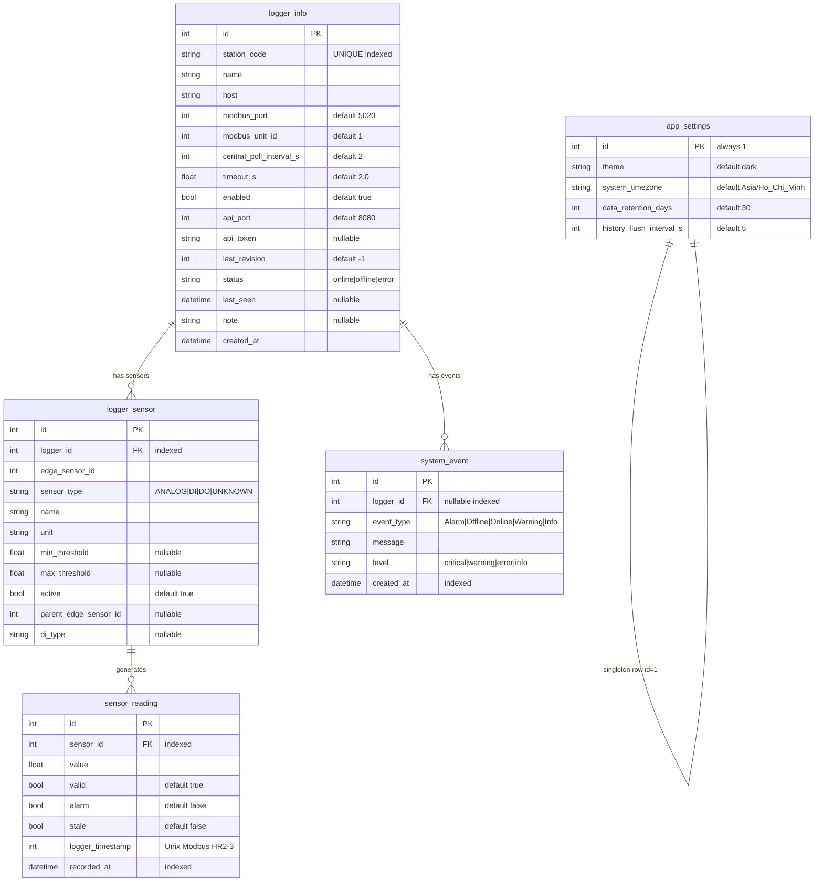
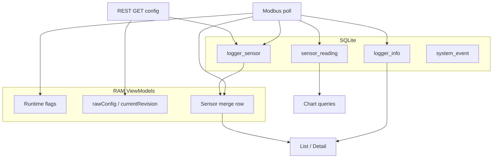

# Thiết kế cơ sở dữ liệu — Central Logger

**Ứng dụng:** Central Logger (Qt 6, C++/QML)  
**Lưu trữ:** SQLite trên máy người dùng  
**Stack C++:** `QSqlDatabase` + driver `QSQLITE` (`Qt6::Sql`) — xem [`adr/0001-db.md`](adr/0001-db.md)  
**Cập nhật:** 2026-05-24

---

## Tổng quan

Central Logger quản lý nhiều **Data Logger** (Modbus TCP + REST). Dữ liệu được chia hai tầng:

| Tầng | Vai trò |
|------|---------|
| **SQLite** | Cấu hình trạm, catalog cảm biến, lịch sử đo, sự kiện, cài đặt app |
| **RAM** | Trạng thái realtime (poll Modbus), form cấu hình tạm (REST), merge hiển thị bảng sensor |

**Đường dẫn DB mặc định:** `~/.central-logger/central-logger.db` (có thể override bằng cấu hình app).

---

## Quy ước thiết kế

| Chủ đề | Quyết định |
|--------|------------|
| API truy cập DB | **`QSqlDatabase` / `QSQLITE`** — repositories qua `QSqlQuery`; test `:memory:` |
| Định danh trạm | `logger_info.station_code` — **UNIQUE**, indexed |
| REST endpoint | `http://{host}:{api_port}/api/v1` — **không** có cột `api_base_url` |
| Catalog cảm biến | Bảng `logger_sensor` — lưu tên, loại, đơn vị, ngưỡng |
| Time-series | `sensor_reading` → FK `logger_sensor.id` (không trỏ thẳng `logger_id`) |
| Auto-create sensor | Modbus poll gặp `edge_sensor_id` mới → INSERT `logger_sensor` với `sensor_type=UNKNOWN`; `GET /config` cập nhật metadata (`sensor_type`, tên, ngưỡng) |
| Live values | **Chỉ Modbus** — FC03 + FC02 + FC01; `GET /readings` chỉ **debug** (JSON gốc, không cập nhật bảng) |
| Trạng thái trạm trên đĩa | `logger_info.status`, `last_seen` — hiển thị/filter khi mở app, chart khi offline |
| Cấu hình edge đầy đủ | Chỉ RAM (`rawConfig`) khi mở form — không bảng riêng trên đĩa |
| Retention | Chỉ xóa `sensor_reading` theo `data_retention_days`; **giữ** `logger_sensor` |

---

## 1. Sơ đồ ERD



### Ràng buộc và index

| Bảng | Ràng buộc |
|------|-----------|
| `logger_info` | `UNIQUE(station_code)`; index `(status)`, `(last_seen)` |
| `logger_sensor` | `UNIQUE(logger_id, sensor_type, edge_sensor_id)`; index `(logger_id)` |
| `sensor_reading` | index `(sensor_id, recorded_at)`; index `(recorded_at)` cho biểu đồ 24h |
| `system_event` | index `(logger_id, created_at)` |
| `app_settings` | một dòng duy nhất `id = 1` |

---

## 2. Chi tiết bảng

### `logger_info`

Cấu hình trạm và kết nối từ Central tới edge.

| Cột | Kiểu | Mặc định | Mô tả |
|-----|------|----------|--------|
| `id` | INTEGER PK | auto | |
| `station_code` | TEXT NOT NULL | — | Mã trạm (QR, REST, hoặc nhập tay) |
| `name` | TEXT NOT NULL | — | Tên hiển thị trên Central |
| `host` | TEXT NOT NULL | — | IP hoặc hostname |
| `modbus_port` | INTEGER | 5020 | Cổng Modbus TCP (Central poll) |
| `modbus_unit_id` | INTEGER | 1 | Unit ID phía client Central |
| `central_poll_interval_s` | INTEGER | 2 | Chu kỳ poll Central (giây) |
| `timeout_s` | REAL | 2.0 | Timeout TCP Modbus |
| `enabled` | BOOL | 1 | Bật/tắt poll |
| `api_port` | INTEGER | 8080 | Cổng REST API |
| `api_token` | TEXT | NULL | Bearer token |
| `last_revision` | INTEGER | -1 | Revision cho `POST /config` |
| `status` | TEXT | `offline` | `online` \| `offline` \| `error` |
| `last_seen` | DATETIME | NULL | Lần giao tiếp thành công gần nhất (UTC) |
| `note` | TEXT | NULL | Ghi chú |
| `created_at` | DATETIME | now UTC | |

Cấu hình edge mở rộng (Buzzer, FTP, Serial, …) không lưu ở đây — xem mục 3.2 (RAM).

---

### `logger_sensor`

Catalog cảm biến trên đĩa: biểu đồ và ngưỡng vẫn dùng được khi trạm tạm mất kết nối (đọc lịch sử `sensor_reading` + metadata).

| Cột | Kiểu | Mặc định | Mô tả |
|-----|------|----------|--------|
| `id` | INTEGER PK | auto | Khóa nội bộ Central |
| `logger_id` | INTEGER FK | — | → `logger_info.id` |
| `edge_sensor_id` | INTEGER | — | ID sensor trên data logger |
| `sensor_type` | TEXT | `UNKNOWN` | `ANALOG` \| `DI` \| `DO` \| `UNKNOWN` |
| `name` | TEXT | — | Tên hiển thị |
| `unit` | TEXT | — | Đơn vị đo |
| `min_threshold` | REAL | NULL | Ngưỡng alarm min |
| `max_threshold` | REAL | NULL | Ngưỡng alarm max |
| `active` | BOOL | 1 | Bật/tắt trên trạm |
| `parent_edge_sensor_id` | INTEGER | NULL | Edge `id` analog cha (từ REST `parent_id`); NULL = top-level |
| `di_type` | TEXT | NULL | Mã attach-DI / báo cáo (`00`–`03`, custom); chủ yếu cho `sensor_type=DI` |

**Tạo bản ghi khi Modbus poll (pseudo):**

```
ON modbus_snapshot(logger_id, edge_sensor_id, value, ...):
  IF NOT EXISTS (logger_id, edge_sensor_id):
    INSERT logger_sensor(..., sensor_type='UNKNOWN', name='', unit='', active=1)
  INSERT sensor_reading(sensor_id, ...)
  UPDATE logger_info SET status='online', last_seen=now() WHERE id=logger_id
```

**Cập nhật metadata từ REST:** sau `GET /config` — cập nhật `name`, `sensor_type`, `unit`, ngưỡng, `active`, `parent_edge_sensor_id`, `di_type` (không dùng `/readings` cho live).

---

### `sensor_reading`

Chỉ lưu giá trị theo thời gian; metadata nằm ở `logger_sensor`.

| Cột | Kiểu | Mô tả |
|-----|------|--------|
| `id` | INTEGER PK | |
| `sensor_id` | INTEGER FK | → `logger_sensor.id` |
| `value` | REAL | ANALOG: float từ FC03; DI/DO: **0.0** hoặc **1.0** chuẩn hóa từ bit FC02/FC01 |
| `valid` | BOOL | Cờ Modbus |
| `alarm` | BOOL | Cờ alarm |
| `stale` | BOOL | Cờ stale |
| `logger_timestamp` | INTEGER | Unix từ HR2–HR3 |
| `recorded_at` | DATETIME | Thời điểm ghi (UTC) |

**Retention:** `DELETE FROM sensor_reading WHERE recorded_at < :cutoff` theo `app_settings.data_retention_days`.

**Truy vấn theo trạm:**

```sql
SELECT r.*
FROM sensor_reading r
JOIN logger_sensor s ON r.sensor_id = s.id
WHERE s.logger_id = :logger_id
  AND r.recorded_at >= :since;
```

---

### `system_event`

| Cột | Kiểu | Mô tả |
|-----|------|--------|
| `id` | INTEGER PK | |
| `logger_id` | INTEGER FK NULL | NULL = sự kiện toàn app |
| `event_type` | TEXT | Alarm, Offline, Online, Warning, Info |
| `message` | TEXT | |
| `level` | TEXT | critical, warning, error, info |
| `created_at` | DATETIME | |

Tên trạm khi hiển thị: `JOIN logger_info` (không lưu `logger_name` trùng lặp).

---

### `app_settings`

Cấu hình toàn cục — luôn một dòng `id = 1`.

| Cột | Mặc định |
|-----|----------|
| `theme` | `dark` |
| `system_timezone` | `Asia/Ho_Chi_Minh` |
| `data_retention_days` | `30` |
| `history_flush_interval_s` | `5` |

---

## 3. Dữ liệu trên RAM

Không ghi SQLite. Quản lý qua ViewModel C++ (`LoggerListModel`, `LoggerDetailViewModel`, `SensorMonitoringTableModel`).

### 3.1 Runtime trạm (Modbus)

| Thuộc tính | Nguồn | UI |
|------------|--------|-----|
| `online` | TCP/Modbus | Icon trạng thái |
| `polling` | Modbus HR1 bit0 | Badge đang poll |
| `rtuConnected` | Modbus HR1 bit1 | RTU RS485 |
| `anyAlarm` | Modbus HR1 bit2 | Cảnh báo cấp trạm |
| `sensorCount` | Modbus HR4 / catalog | Overview |
| `lastUpdate` | Thời điểm poll OK | “Cập nhật X giây trước” |
| `lastError` | Lỗi TCP/Modbus | Debug |
| `statusText` | Logic từ `online` + `lastError` | Text tóm tắt |

`ModbusBridge` đồng bộ `logger_info.status` và `last_seen` khi poll thành công hoặc thất bại; các cờ bit ưu tiên trên RAM cho UI mượt.

### 3.2 Cấu hình trạm (REST — form tạm)

Chỉ tải khi mở **Cấu hình trạm** / **Connect & Load Config**; giải phóng khi đóng form.

| Thuộc tính | Nguồn | Xử lý |
|------------|--------|--------|
| `rawConfig` | `GET /api/v1/config` | JSON đầy đủ edge — map form |
| `currentRevision` | REST | So với `last_revision` trong DB |
| `configForm` | Subset UI | `station_name`, `poll_interval`, `modbus_tcp_*` — persist khi POST apply |
| `cloudForm` | Form Central | `apiToken`, `apiPort` → lưu `logger_info` |
| Lỗi form | Validation | IP, port, token |

Trường REST `config` thường dùng trên form (không lưu DB trừ khi apply):

| REST key | Ghi chú |
|----------|---------|
| `station_code` | Đã trên `logger_info` khi Add/Save |
| `station_name` | Chỉ form |
| `poll_interval` | Device — có thể đồng bộ `central_poll_interval_s` |
| `modbus_tcp_bind`, `modbus_tcp_enabled`, `modbus_tcp_unit_id` | Chỉ form |

Hợp đồng API: [`docs/contracts/rest-config-contract-v1.md`](docs/contracts/rest-config-contract-v1.md)

### 3.3 Sensor realtime (merge)

Merge `logger_sensor` (DB catalog) + snapshot Modbus hiện tại (RAM): FC03 analog + FC02 DI + FC01 DO — cùng nhịp poll.

| Thuộc tính | Nguồn | UI |
|------------|--------|-----|
| `current_value` | Modbus FC03 / FC02 / FC01 | Giá trị trên bảng (DI/DO: bit → ON/OFF) |
| `display_status` | Modbus flags + HR1 + attach-DI (FC02) + ngưỡng | Chip: `WAIT`, `OK`, `ALARM`, `ERR`, `STALE` hoặc nhãn DI (`Monitoring`, `Error`, …) |
| `di_status_code` | Catalog child DI + FC02 | Mã gốc `00`–`03`/custom (debug / màu chip) |
| `alarm_type` | Ngưỡng / bit alarm | `min`, `max`, `min+max` — badge phụ ▼/▲ |
| `catalogError` | REST lỗi catalog | Cảnh báo trên header bảng |
| `timestamp` | Modbus | HH:MM:SS |

---

## 4. Luồng dữ liệu



---

## 5. Khởi tạo và nâng cấp database

### DB mới

Lần chạy app đầu tiên (file DB chưa tồn tại):

1. Tạo file SQLite tại đường dẫn cấu hình (`~/.central-logger/central-logger.db`)
2. Thực thi [`src/data/db/schema/001_initial.sql`](src/data/db/schema/001_initial.sql) — `CREATE TABLE`, index, seed `app_settings` (`id=1`)
3. Gán `PRAGMA user_version = 5` (version hiện tại)

### DB đã tồn tại

[`Database::open()`](src/data/db/Database.cpp) đọc `PRAGMA user_version`, suy luận version khi `user_version = 0` (introspect cột qua `PRAGMA table_info`), rồi chạy migration v2→v5 nếu cần.

| Version | Script |
|---------|--------|
| 2 | [`migrations/002_logger_sensor_attach_di.sql`](src/data/db/migrations/002_logger_sensor_attach_di.sql) |
| 3 | [`migrations/003_logger_sensor_all_parents.sql`](src/data/db/migrations/003_logger_sensor_all_parents.sql) |
| 4 | [`migrations/004_app_settings_history_flush.sql`](src/data/db/migrations/004_app_settings_history_flush.sql) |
| 5 | [`migrations/005_drop_maintenance_mode.sql`](src/data/db/migrations/005_drop_maintenance_mode.sql) |

**Trước migrate:** copy file DB → `{path}.bak` (ghi đè bản cũ), sau `PRAGMA wal_checkpoint(FULL)`.

**Lỗi migrate / DB mới hơn app:** app hiện [`FatalStartup.qml`](src/app/qml/FatalStartup.qml) + [`AlertDialog`](src/components/layout/AlertDialog.qml), thoát khi user đóng dialog.

### Thêm migration mới

1. Cập nhật `001_initial.sql` cho DB mới (schema đích).
2. Thêm `src/data/db/migrations/00N_*.sql` + đăng ký resource trong [`src/data/CMakeLists.txt`](src/data/CMakeLists.txt).
3. Tăng `kSchemaVersion` trong `Database.cpp`.
4. Thêm test upgrade trong [`tests/data/test_database_migrations.cpp`](tests/data/test_database_migrations.cpp).

### Migration phức tạp (rename / đổi PK / rebuild table)

Khi `ALTER TABLE` không đủ, dùng pattern SQLite:

1. `CREATE TABLE new_* (...)`  
2. `INSERT INTO new_* SELECT ... FROM old`  
3. `DROP TABLE old`  
4. `ALTER TABLE new_* RENAME TO old`  
5. Tạo lại index / FK  

Xem template comment [`migrations/_TEMPLATE_rebuild_table.sql`](src/data/db/migrations/_TEMPLATE_rebuild_table.sql). Bước cần introspection có thể gọi `runMigrationStep()` trong C++ (guard `PRAGMA table_info`).

**Checklist release:** bump version, test upgrade từ version trước, cập nhật doc này.

---

## 6. Ánh xạ lớp C++

| Lớp | Trách nhiệm |
|-----|-------------|
| `Database` | `QSqlDatabase` (`QSQLITE`, `Qt6::Sql`): DB mới → `001_initial.sql`; DB cũ → migration v2–v5 + backup `.bak`; fatal lỗi → `FatalStartup.qml` |
| `LoggerRepository` | CRUD `logger_info`, `status`, `last_seen` |
| `SensorCatalogRepository` | CRUD `logger_sensor`, auto-create, upsert REST |
| `SensorReadingRepository` | Batch insert readings, purge retention |
| `EventRepository` | `system_event` |
| `ModbusBridge` | Poll → catalog + readings + cập nhật `logger_info` |
| `SensorMerger` / `SensorStateService` | Catalog DB + Modbus snapshot → table model (không REST live) |
| `LoggerDetailViewModel` | `rawConfig`, `currentRevision` — chỉ RAM |

Cấu trúc mã đề xuất: `src/data/`, `src/core/`, `src/viewmodels/` (chi tiết khi scaffold CMake).

---

